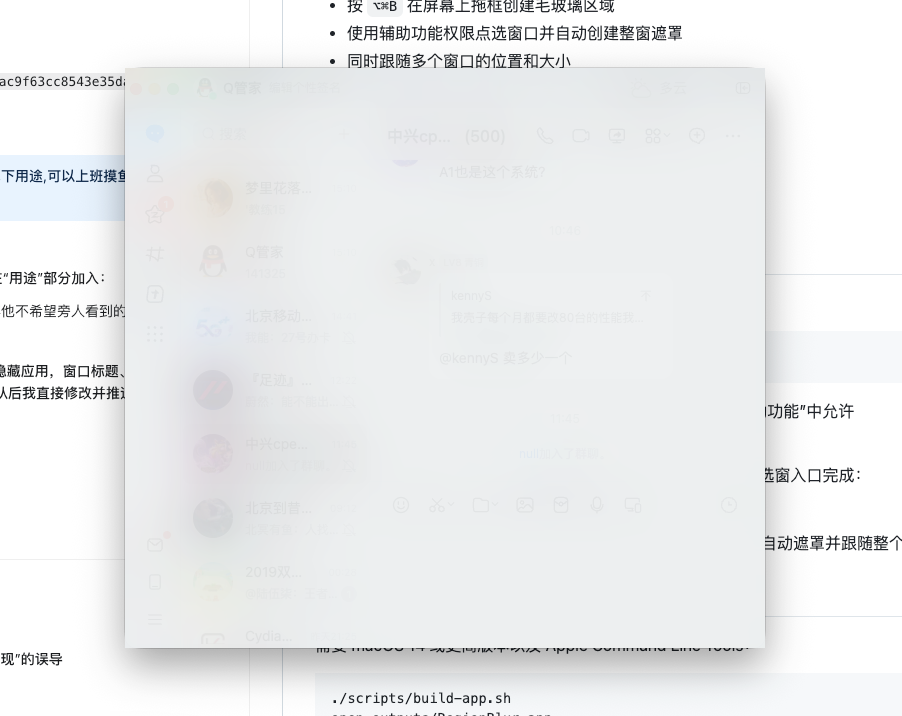

# RegionBlur

一个轻量的原生 macOS 菜单栏工具，用来在屏幕上放置实时毛玻璃遮罩。

## 典型用途

- 工作时临时遮住聊天窗口、私人消息或其他不希望旁人直接看到的内容
- 在演示、共享屏幕或录制教程时遮挡局部敏感信息
- 保留窗口原来的位置和大小，同时减少路过的人看到具体内容

RegionBlur 适合降低屏幕内容被无意看到的概率，但它不等同于隐藏应用。窗口标题、Dock、通知、任务切换界面，以及部分录屏或屏幕共享工具仍可能显示相关信息。

## 效果展示

点选聊天窗口后，RegionBlur 会自动覆盖整个窗口并持续跟随。



## 功能

- 按 `⌥⌘B` 在屏幕上拖框创建毛玻璃区域
- 使用辅助功能权限点选窗口并自动创建整窗遮罩
- 同时跟随多个窗口的位置和大小
- 被跟随窗口调整大小时，整窗遮罩同步调整尺寸
- 窗口最小化、隐藏或被完全遮挡时自动隐藏遮罩
- 全局清晰度滑块
- 可在菜单中开启或关闭开机自动启动
- 管理、删除和临时隐藏多个区域
- 本地保存区域与窗口绑定关系
- 不截取、不上传屏幕内容

## 使用

项目已包含构建好的 Apple Silicon 应用：

```bash
open outputs/RegionBlur.app
```

首次使用自动选窗功能时，在“系统设置 → 隐私与安全性 → 辅助功能”中允许 RegionBlur。

菜单栏中的 `◫` 提供两种清晰的创建方式；窗口跟随统一由自动选窗入口完成：

- “新建模糊区域”：自由拖框，创建固定区域
- “点选窗口并自动遮罩”：鼠标悬停时显示窗口边框，点击后自动遮罩并跟随整个窗口

## 从源码构建

需要 macOS 14 或更高版本以及 Apple Command Line Tools：

```bash
./scripts/build-app.sh
open outputs/RegionBlur.app
```

也可以直接运行测试：

```bash
swift run RegionBlurTests
```

## 隐私与权限

配置保存在本机 Application Support 目录。应用不截取、不上传屏幕内容；模糊层是否出现在录屏或屏幕共享中取决于对应工具。

自动选窗使用 macOS 辅助功能 API 获取用户点击的窗口及其位置。固定区域模式无需该权限。

当前构建采用本地临时签名。自行重新编译后，macOS 可能要求重新添加辅助功能权限。

## 系统要求

- Apple Silicon Mac
- macOS 14+

## License

[MIT](LICENSE)
